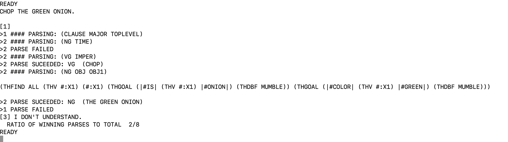

# Description:

This is the Blocks world reworked to a cooking version, where we have a stovetop in place of a table, and a pot as the container. 
The following objects were created, and their attributes:
Choppingboard: brown, rectangular (can place things on it)
Knife: blue, sharp and pointed
Red bellpepper: red, round
Green bellpepper: green, round
Salmon: pink, rectangular
White Onion: white, round 
Green Onion: green, round 
Stovetop: black
Pot: white, is container (can place things in it), already has green onion in it

# Example Usage: 

```sh
READY 
WHAT IS ON THE STOVETOP?
THE GREEN ONION ,THE WHITE ONE ,THE POT ,THE SALMON ,THE KNIFE ,AND THE RED BELLPEPPER .

READY 
PICK UP THE GREEN BELLPEPPER.
~MOVING HAND TO (160 150 200)~
~GRASPING OBJECT B2~
~MOVING HAND TO (160 150 1000)~
OK .

READY 
 PUT THE GREEN BELLPEPPER ON THE CHOPPINGBOARD.
~MOVING HAND TO (100 340 600)~
~LETTING GO~
OK .

READY 
WHAT IS ON THE CHOPPINGBOARD?
THE GREEN BELLPEPPER .

READY 
PUT THE GREEN BELLPEPPER IN THE POT.
~MOVING HAND TO (900 285 400)~
~LETTING GO~
~MOVING HAND TO (100 340 600)~
~GRASPING OBJECT B2~
~MOVING HAND TO (650 650 101)~
~LETTING GO~
OK .

READY 
WHAT IS IN THE POT?
THE GREEN BELLPEPPER AND THE GREEN ONION .

```

# Work-in-progress feature with some bugs:

I have been trying to add a "CHOP" command to the code, but I am having issues with the GRAMAR file successfully parsing all of it...but I think I am so close to getting it to work! If only I had more time. It is mean to only work on onions and bellpeppers, using the knife.
Here is an example of what happens with debug output:
